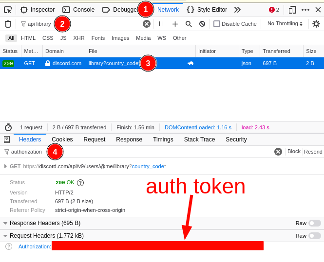

# Discord downloader
Simple utilities to download Discord chat logs and fetch all the attachments
(pictures and videos). It can be used both for Discord servers (group chats) and
for direct messages (private conversations). The code is portable and it should
run under most operating systems.

## How to use it
Download the whole chat history with [discord-fetch.py](src/discord-fetch.py).
It will download the channel history at a rate of 100 messages per GET request,
which is the maximum allowed by the Discord API. It is the only command that
requires an internet connection to work. It might be slow if there are several
messages to fetch. The other commands use the output of this command.

```bash
./discord-fetch.py auth_token channel_id > john_doe.json
```

If the history is huge, it might be convenient to fetch only the last messages
up to a given timestamp. Timestamps are in localtime and they are formatted as
`YYYY-MM-DD HH:HH:SS`.

```bash
./discord-fetch.py auth_token channel_id "2022-01-01 00:00:00" > history_2022.json
```

You can exploit this idea to update an old history file. Use
[discord-chatlog.py](src/discord-chatlog.py) to see the timestamp of the last
message in your `old.json` file, then fetch a `new.json` file using that
timestamp and merge the two files together with `jq -cs '.[0] + .[1]' new.json
old.json > updated.json` (see [jq](https://stedolan.github.io/jq/)).

### Get the chat log in plaintext
To get the chat log in plaintext you can use
[discord-chatlog.py](src/discord-chatlog.py). Like the other commands, it prints
on standard output which is up to you to redirect. Timestamps are in localtime.

```bash
./discord-chatlog.py john_doe.json > john_doe.txt
```

### Download all the attachments
To get a list of all the pictures and videos sent by someone you can use
[discord-attachments.py](src/discord-attachments.py). To download the files you
should pass the output of this command to your favorite download manager. The
following example uses [wget](https://www.gnu.org/software/wget).

```bash
./discord-attachments.py john_doe.json author_id > urls.txt
wget -i urls.txt  # whatever it is your favorite download manager
```

You can get a list of usernames with their author_id with the following command.

```bash
./discord-attachments.py john_doe.json
```

## Where is my auth_token?
Open [discord](https://discord.com/app) from your browser and log in with your
account. Open the web developer tools of your browser (`ctrl + shift + i` or
`f12`) and follow the steps as per the figure:
1. click on the Network tab;
2. write `api library` in the "Filter URLs" field and make sure you selected "All";
3. refresh the web page (`f5` or `ctrl + r`) and select the only request you see;
4. in the Headers tab, write `authorization` in the "Filter Headers" field.



## Where is the channel_id?
Open [discord](https://discord.com/app) from your browser, log in and look at
the urlbar while you are chatting with someone. In direct messages you are
visiting `https://discord.com/channels/@me/<channel_id>`. In a group chat you
are visiting `https://discord.com/channels/<server_id>/<channel_id>`.
